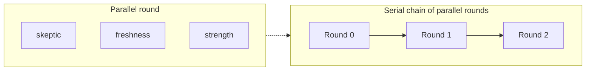

# Observational review

GenLM-Agent can run a **swarm of reviewer agents** over an observation. Each
reviewer applies a *uniquely challenging perspective* and approves only when the
observation withstands its specific challenge. Reviewers run in a single
parallel round, in a serial chain, or as a serial chain of parallel rounds.

## Why challenging perspectives

A single verifier sees a single angle. A swarm of adversarial reviewers makes
gaps visible: an ungrounded claim that survives the skeptic still has to survive
the freshness auditor, the strength auditor, the coverage auditor, the security
reviewer, and the red team. Approval is consensus *after* challenge, not before.

## The default panel

| Perspective | Lens | Challenge |
|-------------|------|-----------|
| `skeptic` | grounding | Every claim must be backed by an evidence reference |
| `freshness-auditor` | freshness | Evidence must be recent and timestamped |
| `strength-auditor` | strength | Demand functional or comparative proof, not proxies |
| `coverage-auditor` | coverage | Every declared scope item must be individually verified |
| `security-reviewer` | security | Flag destructive, privileged, or irreversible actions |
| `red-team` | adversarial | Argue the opposite and resist easy consensus |

Each lens has a deterministic heuristic implementation, so swarm review runs
reproducibly with no external model. Supply your own `ReviewModel` to back any
perspective with a language model instead.

## Execution modes



- **parallel** — every perspective challenges the same target concurrently in one round.
- **series** — each perspective runs in its own round and sees the prior reviewers' verdicts.
- **chain** — a serial chain of parallel rounds; later rounds inherit all prior verdicts (run *in series in a parallel chain*).

## Reviewing an observation

```python
from glmagent.swarm import ObservationalReviewer, ReviewMode, ReviewTarget

target = ReviewTarget.from_observation(
    "repo tests passed at 2026-03-09T12:00:00Z\nall checks passed",
    scope_items=["repo"],
)

reviewer = ObservationalReviewer.with_default_panel()
result = reviewer.review(target, mode=ReviewMode.PARALLEL)

print(result.approved)               # True / False after challenge
for verdict in result.verdicts:
    print(verdict.perspective, verdict.approved, verdict.rationale)
```

## Reviewing an agent step

Any `StepResult` or `TaskStepResult` can be reviewed directly, reusing the
evidence and claims the agent already produced:

```python
from glmagent.swarm import ObservationalReviewer, ReviewMode, ReviewTarget

steps = agent.run("fix the failing test")
target = ReviewTarget.from_step(steps[-1])

result = ObservationalReviewer.with_default_panel().review(target, mode=ReviewMode.CHAIN)
if not result.approved:
    for blocker in result.blockers:
        print(f"[{blocker.perspective}] {blocker.summary}")
```

## Serial chain that builds on prior critiques

In `series` and `chain` modes, later reviewers receive every earlier verdict.
The red team uses this to challenge unanimous approval:

```python
from glmagent.swarm import ObservationalReviewer, ReviewTarget

target = ReviewTarget.from_observation("build succeeded", scope_items=["build"])
result = ObservationalReviewer.with_default_panel().review_series(target)

red_team = result.verdicts[-1]
print(red_team.findings[0].summary)
# "... prior reviewers approved unanimously; insist on independent confirmation"
```

## Custom perspectives and policy

```python
from glmagent.swarm import (
    ObservationalReviewer, ReviewLens, ReviewPerspective, ReviewPolicy,
)
from glmagent.verification import EvidenceLevel

house_style = ReviewPerspective(
    name="house-style",
    lens=ReviewLens.STRENGTH,
    challenge="Reject anything weaker than a passing test suite.",
    min_evidence_level=EvidenceLevel.FUNCTIONAL,
)

reviewer = ObservationalReviewer(
    perspectives=[house_style],
    policy=ReviewPolicy(approval_threshold=1.0, stop_on_blocker=True, max_workers=4),
)
```

## CLI

```bash
glmagent review-observation \
  --text "repo tests passed at 2026-03-09T12:00:00Z" \
  --scope repo \
  --mode parallel
```

Restrict the panel and add a proposed action for safety review:

```bash
glmagent review-observation \
  --text "cleaning up workspace" \
  --action "rm -rf /tmp/data" \
  --perspective security-reviewer
```

The command prints the JSON review result and exits non-zero when the swarm
withholds approval.
